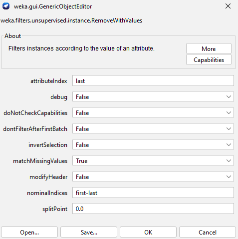
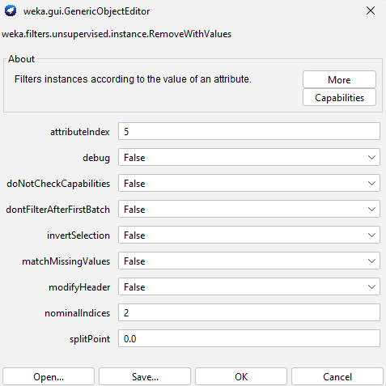
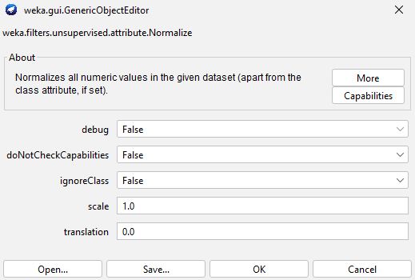
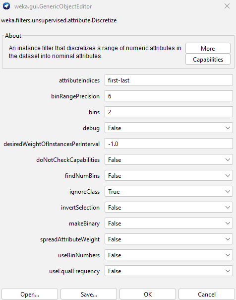
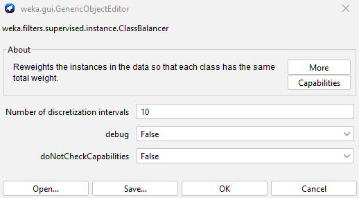
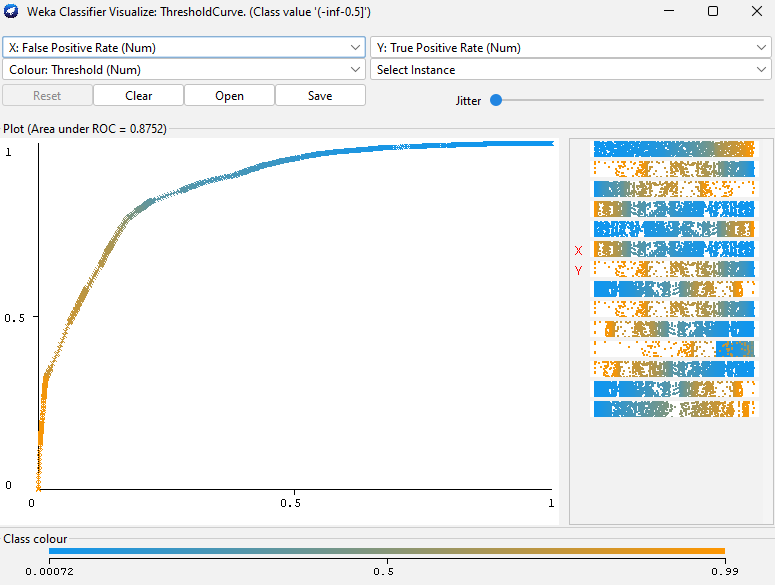

# Inženjerstvo podataka i znanja - projekat 3 - Klasifikacija
## Dataset
Iskoristili smo dataset koji sadrži informacije o pacijentu kao i to da li boluje od dijabetesa ili ne i na osnovu toga ga klasifikuje.
https://www.kaggle.com/datasets/iammustafatz/diabetes-prediction-dataset
## Priprema podataka
- **Čišćenje od pogrešnih vrednosti.** weka.filters.unsupervised.instance.RemoveWithValues sa matchMissingValues na True i attributeIndex na last kako bi matchovao sve instance kojima fali atribut "diabetes" i uklonio ih.
- 
- Takođe smo obrisali nepotrebne instance koje za "Smoking history" imaju "No info"
- 
- **Skaliranje i normalizacija podataka** weka.filters.unsupervised.attribute.Normalize sa scale na 1.0 i translation 0.0 koji normalizuje numeric vrednosti atributa na opseg 0-1
- 
- **Diskretizacija klase** weka.filters.unsupervised.attribute.Discretize sa bins na 3, attributeIndices na last i ignoreClass na False da diskretizuje "diabetes" i pretvori ga iz numeric u nominal tip atributa kako bi omogućili korišćenje classifiera sa "diabetes" kao klasom
- 
- **Balansiranje skupa podataka** weka.filters.supervised.instance.ClassBalancer koji klasama dodaje težine kako bi se nadomestile razlike u broju instanci za svaku klasu.
- 
## Klasifikacija
- *trees.J48*
  	- cross validation 10 folds 80.3999%
	- 80-20 split 79.7046%
- *bayes.NaiveBayes*
  	- cross validation 10 folds 80.6792%
	- 80-20 split 80.3494%
 - *rules.ZeroR*
  	- cross validation 10 folds 57.0346%
	- 80-20 split 56.1969%
- *lazy.lBk (KNN=1)*
	- cross validation 10 folds 80.3125%
	- 80-20 split 79.6945%
 - *lazy.lBk (KNN=3)*
	- cross validation 10 folds 80.3278%
	- 80-20 split 79.6907%
 - *lazy.lBk (KNN=5)*
	- cross validation 10 folds 80.347%
	- 80-20 split 79.8064%

NaiveBayes daje najveću tačnost od svih klasifikatora. Bazira se na primeni Bayes-ove teoreme. Jednostavna statistička tehnika koja određuje verovatnoću da nepoznati slog pripada određenoj klasi.

NaiveBayes je pokazao najveći Kappa statistic parametar od 0.6066 koji predstavlja meru korelacije. Površina ispod ROC krive iznosi 0.8752.

## Rezultati
Correctly Classified Instances       **58629.5689**          **80.6792 %**
Incorrectly Classified Instances     **14040.4362**         **19.3208 %**
Kappa statistic                          **0.6066**
Mean absolute error                      **0.2672**
Root mean squared error                  **0.3741**
Relative absolute error                 **54.5108 %**
Root relative squared error             **75.5814 %**
Total Number of Instances            **72670.0051**
